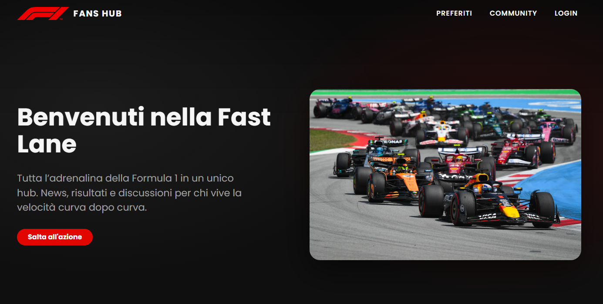
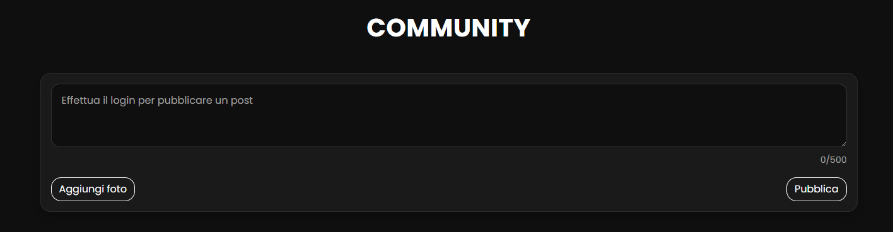

# 🏎️ F1 Fans Hub

F1 Fans Hub è una piattaforma web che raccoglie tutte le news sulla Formula 1, offrendo agli utenti la possibilità di salvare articoli e partecipare attivamente a una community dedicata.

## 🚀 Demo

👉 https://f1-fans-hub-fe.vercel.app

---

## 📸 Preview

### 🏁 Homepage

### 📰 News Section

### 📊 More News

### 👥 Community

---

## ✨ Funzionalità

- Registrazione e login utenti
- Visualizzazione news F1 tramite API
- Salvataggio articoli preferiti
- CRUD dei contenuti utente
- Creazione, modifica ed eliminazione post
- Sistema di commenti e like
- Interazione con la community

## 🛠️ Tecnologie utilizzate

### Frontend

- React
- Bootstrap
- Sass

### Backend

- Java (Spring Boot)
- REST API
- JWT Authentication

### Database

- PostgreSQL

---

## 📡 Backend

- 🔗 Backend Repository: https://github.com/SabatinoProvenza/F1-Fans-Hub-BE
- 🌐 API Base URL: https://considerable-ilise-me-stesso-f977c3cb.koyeb.app

---

## 🔗 Repository collegati

- Frontend: https://github.com/SabatinoProvenza/F1-Fans-Hub-FE
- Backend: https://github.com/SabatinoProvenza/F1-Fans-Hub-BE

---

## 👤 Autore

**Sabatino Provenza**
